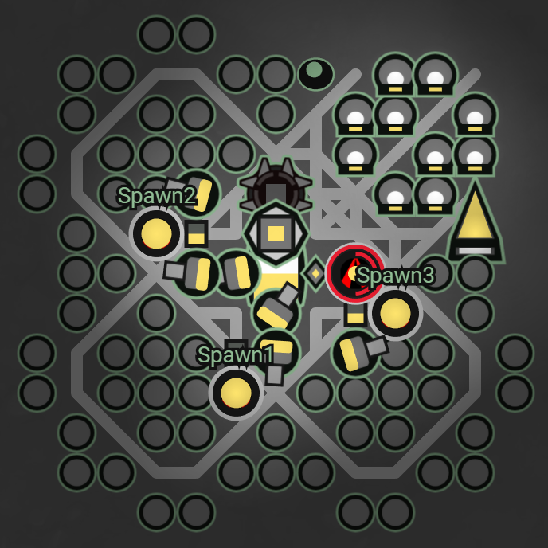

# 建筑规划
BeeBot 采用固定基地+规划外围路线的模式。

## 基地模板

### 基地特点
 - 基地的规格为11*11，比大多数的固定基地都要小
 - creep出口较多，避免creep及地形堵塞
 - 外围有12个补充的extension，在地形不合适的时候将丢弃
 - 环绕型lab摆放及出口可以加快la填充、boost及出兵速度
 - 在link上方停靠manager，基本不用移动
 - filler采用3线固定路线填充，提高填充效率，弥补extension不全的劣势

## 外围路线
从storage向外寻找到每个source、mineral及controller的路径，压缩存储在segment1。

rcl每升一级都会重新规划一次，保证是最佳路线。